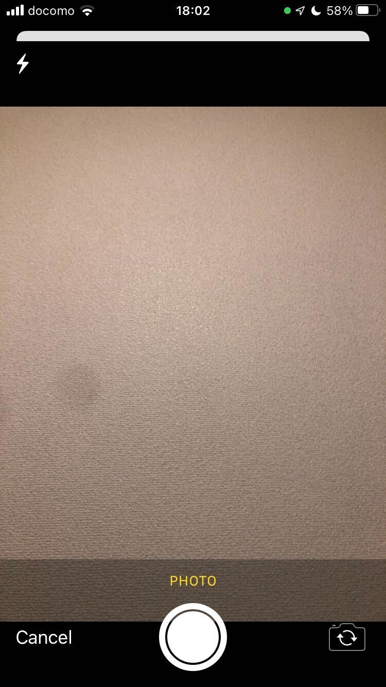
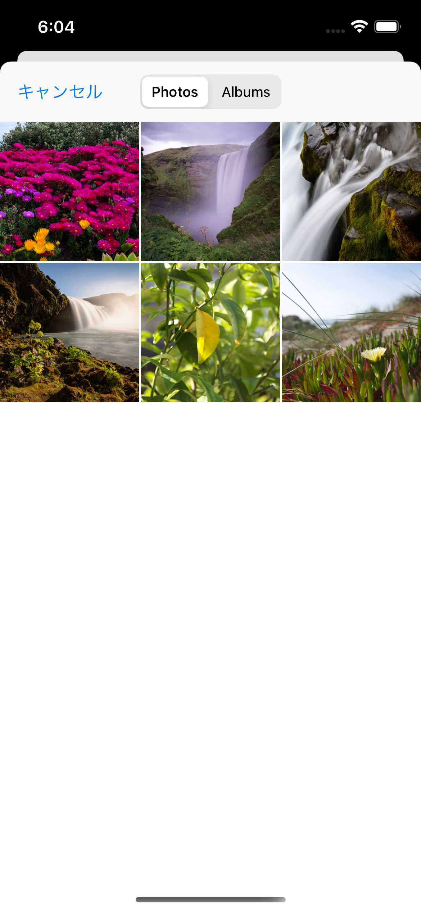

SwiftUIでカメラ/フォトライブラリを使用する
===

 

## カメラ
- `UIImagePickerController`を使用する

※ Sheetでカメラを表示した例

 

## フォトライブラリ
- `PHPickerViewController`を使用する
  - `UIImagePickerController`の`sourceType`を指定することでも可能だが現在は非推奨

※ Sheetでフォトライブラリを表示した例
